# Ruta NPCs

## Disclaimer

Este documento se ha hecho con la intencion de agilizar el proceso de farmeo de un video del canal [PaludaGameplays](https://www.youtube.com/watch?v=UZlUTX15irA). Recomiendo encarecidamente verlo para conseguir entender en profundidad la guia.

## Regiones

~~~
Kanto. (Opcional)
Teselia. (Recomendado)
Shinnoh. (Obligatoria)
~~~

## Pokemons

Ambos necesitan los movimientos carambano y en caso del Mamoswine Terremoto tambien es necesario.

Los objetos son Dados Trucados para Mamoswine y Cinta Elegida para Cloyster.

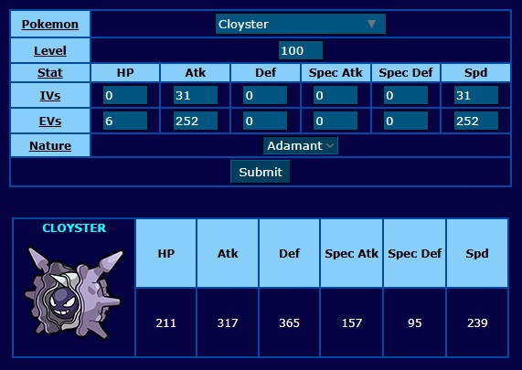

~~~
!Disclaimer Se puede hacer con 2 copias exactas del mismo pokemon, pero es recomendable tener un Cloyster y un Mamoswine
~~~

## Ruta

### Kanto

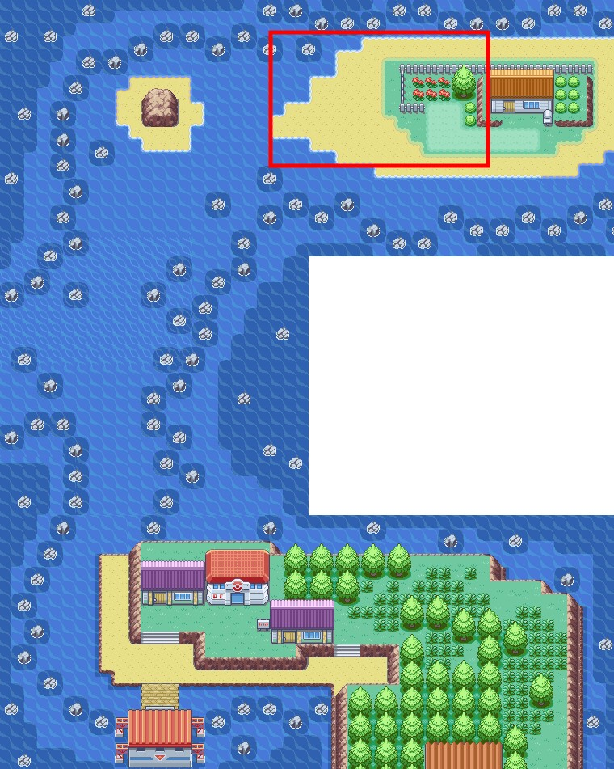

Subimos y peleamos con las 2 ninyas del sombrero.

### Teselia

Vamos a Teselia y llegamos a Bahia Arenisca

Salimos a la Ruta 13 hacia arriba y peleamos contra los 2 ancianos

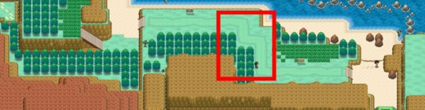

Volamos a Ciudad Caolin.

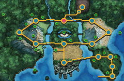

Salimos por la izquierda y vamos al centro comercial.

Buscamos en la primera planta a el ninyo bien.

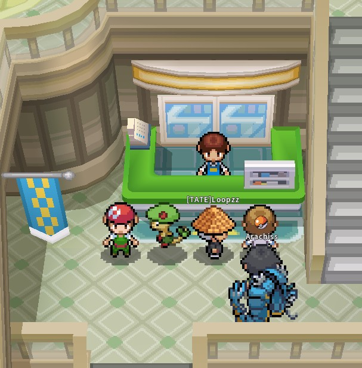

Subimos por la escalera de la derecha y peleamos con Damisela Eugenia.

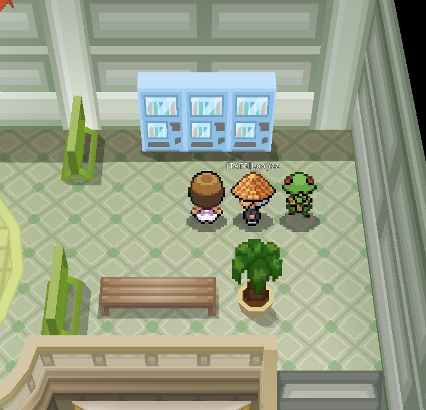

Volamos de nuevo a Ciudad Caolin

Salimos por arriba y llegamos a la ruta 10 peleamos con los entrenadores marcados.

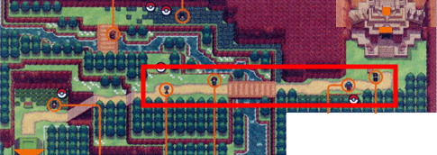

### Shinnoh

LLegamos a Shinnoh y volamos a Rocavelo

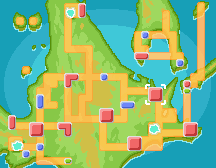

Bajamos hacia ruta 214 y peleamos con el npc marcado.

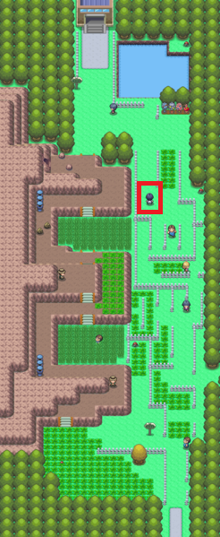

Volvemos a Rocavelo y salimos por la izquierda a ruta 215, peleamos contra los 2 npcs, !COMBATIR 1 a 1.

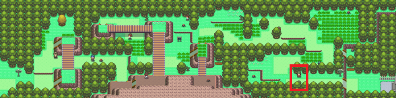

Volamos a Pueblo Sosiego

Subimos a la ruta 210 y hacemos el combate doble usando carambano en ambos rivales

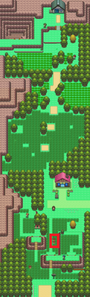

Volamos a Ciudad Marina salimos por la izquierda a la ruta 222

En la ruta peleamos con el siguiente NPC

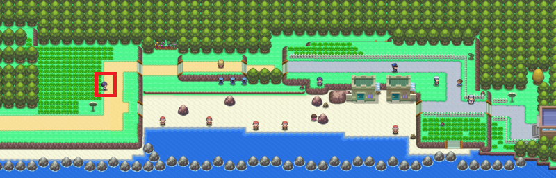

Volamos a Zona Sobrevivir

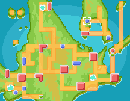

Salimos a la derecha a ruta 226 y haciendo treparrocas peleamos con el npc 

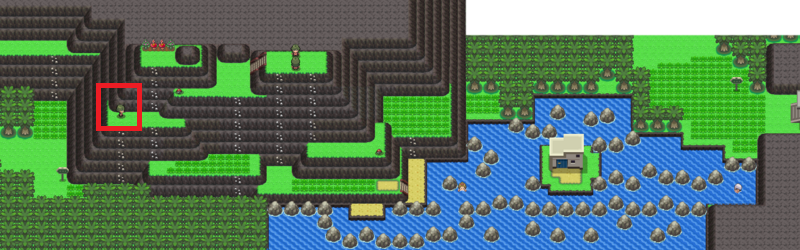

Volvemos a Zona Sobrevivir

Salimos por la izquierda hacia ruta 225 y peleamos con los siguientes npc

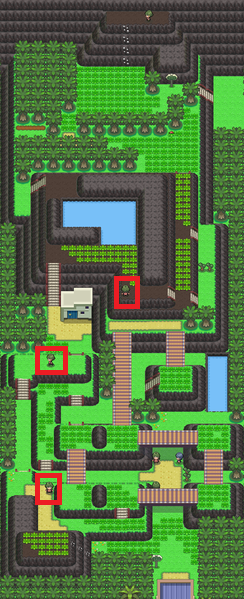

Volamos a pueblo caelestis.

Salimos hacia la derecha en ruta 210, USAMOS DESPEJAR y peleamos contra los siguientes npc

Volamos a Ciudad Puntaneva

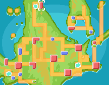

Entramos al gimnasio y hacemos la siguiente ruta de entrenadores

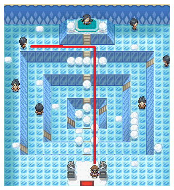
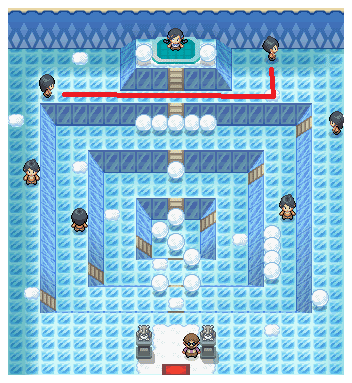
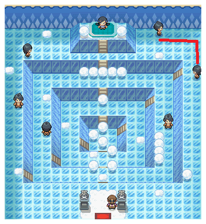
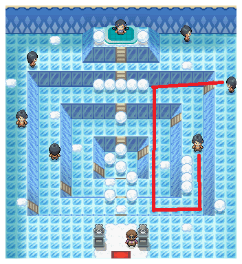
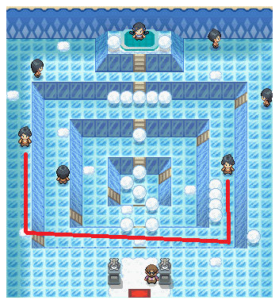

Salimos y nos dirijimos a los ultimos entrendaores volando a Zona descanso

Subimos a la ruta 229 y peleamos con los 2 entrenadores por separado.

Seguimos subiendo a la Ruta 228 y peleamos contra los ultimos entrenadores

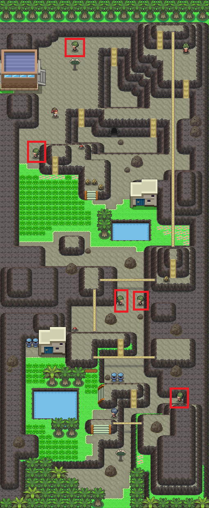
